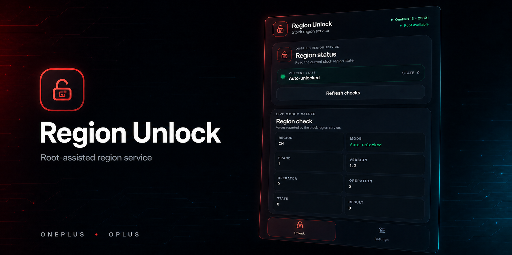

# OnePlus Region Unlock

A standalone, root-assisted Android app for reading and changing the stock
region-lock state on compatible OnePlus and OPlus phones. Everything needed by the app is
packaged in the APK.

> [!CAUTION]
> Use this only on a phone you own or are authorized to service. Locking the
> region is intended for controlled testing and may behave differently between
> device generations. This project does not generate local unlock codes, forge
> provisioning blobs, or bypass modem signature verification.

## Validated devices

| Device | Model | PRJ-ID | Status |
|---|---|---:|---|
| OnePlus 13 | `PJZ110` | `23821` | Lock and unlock confirmed on stock OPlus OS |
| OnePlus 13T | `PKX110` | `24821` | Identity support added; stock-device validation ongoing |
| OnePlus 15 | `PLK110` | `24831` | Lock and unlock confirmed on stock OPlus OS |
| OnePlus Ace 5 Pro | `PKR110` | `24811` | Identity support added; stock-device validation ongoing |
| OnePlus Ace 5 | `PKG110` | `23851` | Identity support added; stock-device validation ongoing |
| OnePlus Ace 6 | `PLQ110` | `24851` | Identity support added; stock-device validation ongoing |
| OnePlus Ace 6T | `PLR110` | `24855` | Identity support added; stock-device validation ongoing |

PRJ-ID is used only to display a friendly device name. Command eligibility is
determined from the live stock-service response: the region must be exactly
`CN`. The backend repeats this check immediately before every state-changing
request, so a UI-only or stale result cannot bypass it.

## Requirements

- a device whose compatible stock OPlus region service reports `Region: CN`;
- root through Magisk, KernelSU, APatch, or another provider with a working
  `su` command;
- the stock OPlus telephony framework and subsystem-radio service.

A custom ROM may retain the vendor radio HAL while omitting the stock framework
service the app needs. In that case the app can identify the phone, but the
region check fails and all state-changing actions remain disabled.

## Install the app

### On the phone

1. Open the repository's **Releases** page and select the latest release.
2. Download `oplus-region-unlock-app-v<version>-release.apk` to the phone.
3. Open the APK and allow installation from that source if Android asks.
4. Open **Region Unlock** and approve the root request from your root manager.

### With ADB

Connect the phone with USB debugging enabled, then run:

```sh
adb install -r oplus-region-unlock-app-v<version>-release.apk
```

Open **Region Unlock** on the phone and approve the root request.

## Unlock the region

1. Open the app and wait for the automatic checks to finish.
2. Confirm that **Root available** appears beside the device information.
3. Review the full live result in the **Region check** card. It shows region,
   mode, brand, version, operator, operation, state, and result.
4. Tap **Unlock region** at the bottom of the card and confirm.
5. When the app accepts the request, tap **Reboot now**.
6. After boot, reopen the app or tap **Refresh checks**. The expected automatic
   unlock result is `state=0` and `result=0`.

If the phone already reports state `0`, the button reads **Already unlocked**
and cannot send the request again.

## Lock the region for testing

The lock action is under **Settings > Lock region**. It requires two warning
confirmations and the exact uppercase word `LOCK` before the backend requests
locked state `1`.

Reboot, then refresh the checks to confirm the actual modem state. A request
being accepted only means it was submitted; the refreshed state is the final
result. Lock and unlock persistence have been verified on OnePlus 13 and
OnePlus 15, but are not currently verified on OnePlus 13T, OnePlus Ace 5 Pro,
OnePlus Ace 5, OnePlus Ace 6, or OnePlus Ace 6T.

## State values

| State | Meaning |
|---:|---|
| `-1` | Invalid or test-locked |
| `0` | Automatically unlocked |
| `1` | Locked |
| `2` | Sale/provisioning unlocked |
| `3` | Server locked |
| `4` | Server unlocked |
| `5` | Locally unlocked with a code |

The app's **Unlock region** action requests automatic unlock state `0`. State
`2` is a separate stock provisioning path that requires a valid signed blob;
the app does not create or submit one.

## How it works

Stock OPlus firmware rejects these region API calls from root UID `0`. After root is
approved, the app runs its packaged client as Android system UID `1000`, reads
the current state through the stock OPlus telephony framework, and sends the
stock subsystem-radio request. State changes happen only after an explicit
action in the app; nothing is installed to run during boot.

Safety gates require all of the following before a state-changing action is
enabled:

- a successful live `Region: CN` result;
- working root access;
- a successful read from the stock region service;
- a state other than `0` for the unlock action;
- explicit user confirmation.

## Build from source

Requirements:

- JDK 21;
- Android SDK Platform 36 and matching build tools;
- a private Android release-signing keystore;
- `sha256sum`.

Provide the signing configuration and build the release APK from the repository
root:

```sh
JAVA_HOME=/path/to/jdk21 \
ANDROID_SDK_ROOT=/path/to/android-sdk \
REGION_UNLOCK_KEYSTORE=/path/to/release.keystore \
REGION_UNLOCK_STORE_PASSWORD=your-store-password \
REGION_UNLOCK_KEY_ALIAS=region-unlock \
REGION_UNLOCK_KEY_PASSWORD=your-key-password \
./build-app.sh
```

Keep the keystore and its passwords backed up securely. Losing them prevents
future releases from updating an already installed copy of the app.

The build creates:

```text
dist/oplus-region-unlock-app-v0.4.3-release.apk
dist/SHA256SUMS
```

Verify the APK checksum with:

```sh
(cd dist && sha256sum -c SHA256SUMS)
```

GitHub Actions also builds the app on every push and pull request. Run the
**Build Android app** workflow manually from the repository's **Actions** tab
when an on-demand APK is needed. The APK and checksum are available together
as the workflow run's downloadable artifact for 14 days.

## Publish a release

Create and push a stable semantic-version tag from the commit to release:

```sh
git tag v0.5.0
git push origin v0.5.0
```

The **Build Android app** workflow validates the `vMAJOR.MINOR.PATCH` tag,
sets the APK's version name and Android version code, builds and verifies the
APK, and publishes it with `SHA256SUMS`. The release notes contain a changelog
of non-merge commits since the previous version tag and a link to the full
GitHub comparison.

## Project layout

```text
android-app/                                Android application and interface
src/dev/oplus/regionunlock/RegionUnlock.java Packaged stock-radio client
build-app.sh                                App build and packaging script
```

## License

Copyright 2026 koaaN. Licensed under the [Apache License 2.0](LICENSE).

This project is not affiliated with, endorsed by, or sponsored by OnePlus or
OPlus. Product names and trademarks belong to their respective owners.
